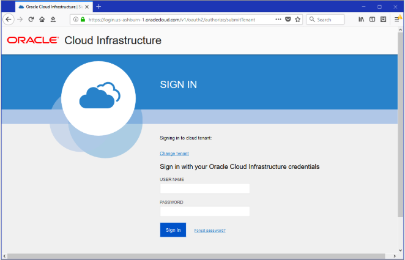
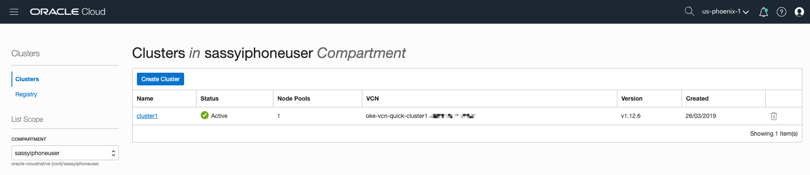
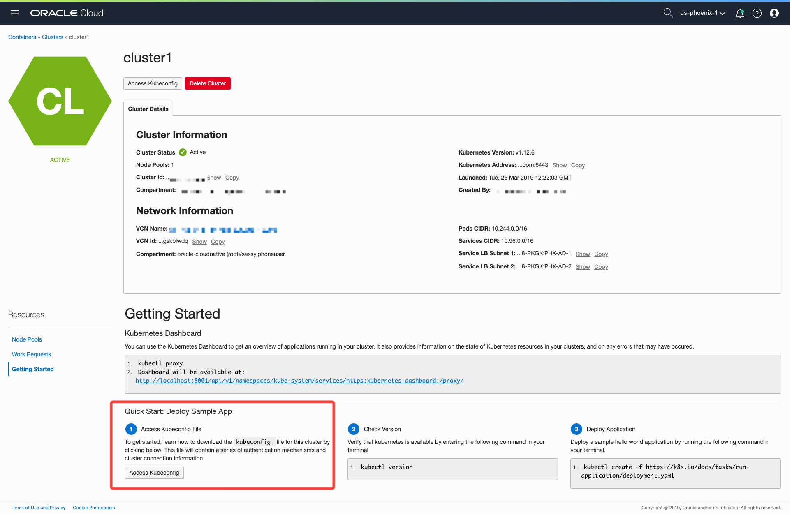
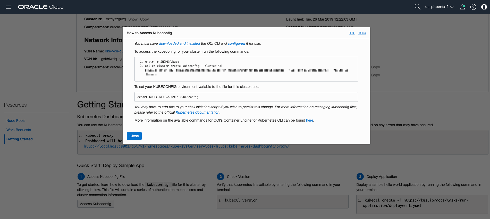
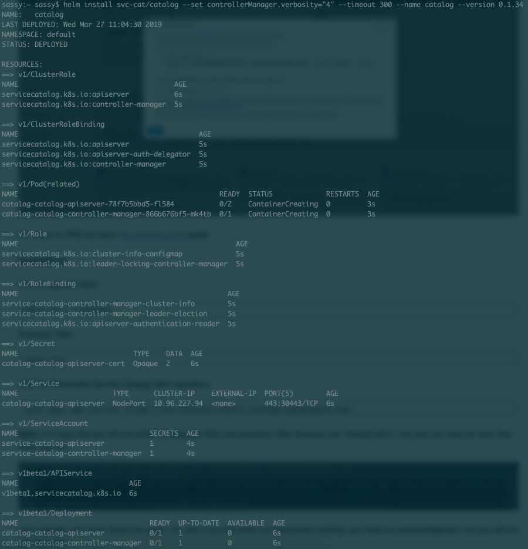
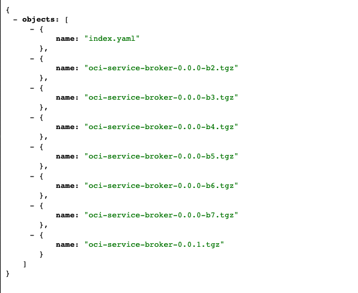
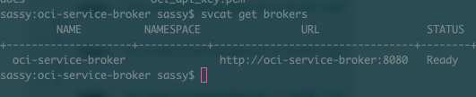
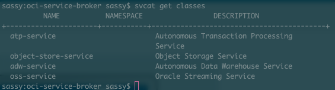

### OCI Service Broker

The Oracle Cloud Infrastructure (OCI) Service Broker is an implementation of the [Open Service Broker API](https://www.openservicebrokerapi.org/) for OCI services. The aim of this is to create a Service Broker for OCI which customers can install in their Kubernetes clusters, in Oracle Kubernetes Engine (OKE) and in on-premises platforms. 


#### The OCI Service Broker Installation Methods 

There are a couple of installation methods to choose from: 

* Helm Chart based, which can be used to install in Kubernetes environments. 
* Docker container based, which can be run in any Docker setup.
* The source code can be built and run in any Java Virtual Machine (JVM).

In this guide, we will focus on the Helm installation method. For the other methods, we encourage you to go directly to the [Oracle Cloud Infrastructure (OCI) Service Broker documentation](#linktodocs}

### Prerequisites

* Oracle Kubernetes Engine (OKE) cluster
* Kubectl installed and pointing at your OKE cluster
* Helm with Tiller permissions installed on OKE
* Service Catalog and CLI installed on OKE
* [Then JSON chrome extension](https://chrome.google.com/webstore/detail/jsonview/chklaanhfefbnpoihckbnefhakgolnmc?hl=en)


### Installation Steps 

#### API Key and OCI CLI


1. Set up an [API key](https://docs.cloud.oracle.com/iaas/Content/API/Concepts/apisigningkey.htm#How)

2. Install the [OCI CLI](https://docs.cloud.oracle.com/iaas/Content/API/SDKDocs/cliinstall.htm)


**Note:** To avoid the CLI from presenting installation errors, Mac OSX users need to install Python 2.7 and up. 
 
```
$ brew install python@2
```


#### OKE Cluster Setup


In a browser, go to the URL you've been given to log in to OCI and enter your username and password.




* In the console, open the navigation menu. Under "Solutions, Platform and Edge", go to "Developer Services" and click Container Clusters.
* Choose a compartment that you have permission to work in, and in which you want to create both the new cluster and the associated network resources.





* Click "create a new cluster" and opt for the "quick create". Once the cluster has been created, go back to the console and scroll down to access the `kubeconfig`. 






For more on OKE we have [this amazing guide](https://cloudnative.oracle.com/template.html#distributed-systems-management/container-orchestration/oke/quickstart.md) guide. 


### Installation 

#### Install the Service Catalog

First, upgrade Helm: 

```
helm init --upgrade
```

Provision Tiller: 

```
helm init 
```

Add the Kubernetes Service Catalog Helm repository: 

```
helm repo add svc-cat https://svc-catalog-charts.storage.googleapis.com
```

**Note:** £10 says that you did not bother to upgrade Helm and provision Tiller because you "already did it", but now you have an error that looks like this: 


Just upgrade, and never doubt me again. Oh, and if you did follow my instructions dutifully, you have my acknowledgment, but you will not see that £10. 

Install the Kubernetes Service Catalog Helm chart:

```
helm install svc-cat/catalog --set controllerManager.verbosity="4" --timeout 300 --name catalog --version 0.1.34
```
Your output should look like this: 




#### Install the svcat Tool 

`svcat` is the CLI tool for Service Catalog. Follow the instruction in the svcat [docs](https://svc-cat.io/docs/install/#installing-the-service-catalog-cli) to install the svcat tool:

```
brew update && brew install kubernetes-service-catalog-client
```
#### Install the OCI Service Broker 

There are two key parts to this; installing the OCI Service Broker and authentication. Let's start with authentication.

**OCI Credentials**

Values under ociCredentials.secretName should contain the name of the Kubernetes Secret that contains the OCI user and the credentials details. This will be used to provision and manage services/resources in the user tenancy.

The secret should have the below keys and respective values:

* `tenancy`	the OCID of your tenancy
* `fingerprint`	the fingerprint of your OCI user
* `user`	OCID of the user
* `passphrase`	the passphrase of the private key (if passphrase is set then set the value to an empty string)
* `privatekey`	the OCI User private key
* `region`	the region in which the OKE cluster is running. The value should be in OCI region format. Example: us-ashburn-1

You would have come across some of the values required in the above when you set up your [API key](https://docs.cloud.oracle.com/iaas/Content/API/Concepts/apisigningkey.htm#How) and installed the [OCI CLI](https://docs.cloud.oracle.com/iaas/Content/API/SDKDocs/cliinstall.htm).

Run the command below to create Secret by ociCredentials. (Replace values with your user credentials.)

```
kubectl create secret generic ocicredentials \
--from-literal=tenancy=ocid1.tenancy.oc1..<YOUR TENANCY> \
--from-literal=user=ocid1.user.oc1..<YOUR USER OCID> \
--from-literal=fingerprint=<YOUR FINGER PRINT> \
--from-literal=region=<YOUR REGION> \
--from-literal=passphrase="" \
--from-file=privatekey=${HOME}/.oci/oci_api_key.pem
```

**Installing the OCI Service Broker**

**Note:** this is where the [JSON chrome extension](https://chrome.google.com/webstore/detail/jsonview/chklaanhfefbnpoihckbnefhakgolnmc?hl=en) will come in handy.

The OCI Service Broker is packaged as a Helm chart and the user can deploy the broker using this chart. The chart is hosted in the Helm repo and can be downloaded from the URL below:

```
https://objectstorage.us-ashburn-1.oraclecloud.com/n/oci-cnp-dev/b/chart-repo-incubator/o/oci-service-broker-<REPLACE_LATEST_VERSION>.tgz
```

To make it easy, copy this into your browser: 

```
https://objectstorage.us-ashburn-1.oraclecloud.com/n/oci-cnp-dev/b/chart-repo-incubator/o/
```

You should see this: 



Choose the bottom one, and add it to the URL above. At the time of writing I had this: 

```
https://objectstorage.us-ashburn-1.oraclecloud.com/n/oci-cnp-dev/b/chart-repo-incubator/o/oci-service-broker-0.0.0-b7.tgz
```

Now copy the above URL into your browser. A tarball will automatically download. 

**Note:** The version of the tarball may change, so make sure you check. 

Unzip this tarball and pop the "oci-service-broker" into whatever directory you normally use. 


#### Install the OCI Service Broker Chart 

```
helm install https://objectstorage.us-ashburn-1.oraclecloud.com/n/oci-cnp-dev/b/chart-repo-incubator/o/oci-service-broker-0.0.0-b7.tgz  --name oci-service-broker \
  --set ociCredentials.secretName=ocicredentials \
  --set storage.etcd.useEmbedded=true \
  --set tls.enabled=false
```
**Note:** My broker version is `0.0.0-b7`; there might be a different one available. Modify this code snippet accordingly. 

#### Register the OCI Broker

The sample files are available under `oci-service-broker/samples` directory inside charts. The command below extracts the chart that contains the sample files.

```
curl https://objectstorage.us-ashburn-1.oraclecloud.com/n/oci-cnp-dev/b/chart-repo-incubator/o/oci-service-broker-<REPLACE_LATEST_VERSION>.tgz | tar xz
```

Create a `ClusterServiceBroker` resource with Oracle Service Broker URL to register the broker.

```
kubectl create -f oci-service-broker/samples/oci-open-service-broker.yaml
```

Get the status of the broker:

```
svcat get brokers
```
 You should see something like this: 
 
 
 
We're in! Now let's have a look at the classes available to us. If you have not read the [Kuberentes Service Brokers: Part One](https://cloudnative.oracle.com/template.html#infrastructure/resource-management/service-broker/service-broker-tutorial-part-one.md) I would recommend doing so to understand the terminology. But for now, the `ClusterServiceClass` is a type of managed service offered by a particular broker. Each time a new `ClusterServiceBroker` resource is added to the cluster (like we just did in the step above), the service catalog controller connects to the corresponding broker server to obtain a list of service offerings (small plan, medium plan, etc.). A new `ClusterServiceClass` resource will automatically be created for each. With that said, let's have a look at what the OCI Service Broker has to offer us. 

Type the following into your terminal to get the classes: 

```
svcat get classes
```

Oooh, at the time of writing we have access to plans from the [Autonomous Transaction Processing Service](https://www.oracle.com/uk/database/autonomous-transaction-processing.html), The [Object Storage Service](https://cloud.oracle.com/en_US/storage/object-storage/features), The [Autonomous Data Warehouse Service](https://cloud.oracle.com/en_US/datawarehouse) and the [Oracle Streaming Service](https://cloud.oracle.com/en_US/streaming). This is what it looks like for the curious: 

 
 
 In the next installment we're going to have a look at how to get a `ServiceInstance` and a `ServiceBinding` in Autonomous Transaction Processing.  


